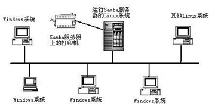

<h1 style="text-align:center">网络服务-SAMBA</h1>

## 1. Samba 概述

SMB（Server Messages Block，信息服务块）是一种在局域网上共享文件和打印机的一种通信协议，它为局域网内的不同操作系统的计算机之间提供文件及打印机等资源的共享服务。SMB 协议是客户机/服务器型协议，客户机通过该协议可以访问服务器上的共享文件系统、打印机及其他资源。如图：

<div style="text-align: center;"></div>

## 2. samba和ftp的区别

- ### ftp 的优缺点：

优点：文件传输、应用层协议、可跨平台

缺点：只能实现文件传输，无法实现文件系统挂载；无法直接修改服务器端文件

- ### Samba 的特性：

使用 smb/cifs 协议、可跨平台、可实现文件系统挂载、可实现服务器端修改文件

## 3. smb 协议和 cifs 之间的关系

随着 Internet 的流行，Microsoft 希望将这个协议扩展到 Internet 上去，成为 Internet 上计算机之间相互共享数据的一种标准。因此它**将原有的几乎没有多少技术文档的SMB 协议进行整理，重新命名为CIFS（Common Internet File System），它使程序可以访问远程 Internet 计算机上的文件并要求此计算机提供服务**。客户程序请求远在服务器上的服务器程序为它提供服务。服务器获得请求并返回响应。CIFS 是公共的或开放的 SMB 协议版本，并由 Microsoft 使用。 SMB 协议在局域网上用于服务器文件访问和打印的协议。

## 4. Samba 服务详解

#### 4.1 Samba 软件相关信息

1. 协议：SMB/CIFS
2. 服务：

​		smb        实现资源共享、权限验证              TCP 139 445

3. 配置文件（/etc/samba/）

smb.conf        主配置文件

smbusers        别名配置文件

#### 4.2 登陆验证模式（安全级别）

- share 匿名验证

- user 本地用户验证（Samba服务器默认的安全级别，用户在访问共享资源之前必须提供用户名和密码进行验证）**拓展：**tdbsam：该方式是使用一个数据库文件来验证。数据库文件叫passdb.tdb。可以通过pdbedit -a 向数据库中添加新用户，不过要建立的Samba用户必须先是系统用户。也可以理解为我们使用pdbedit -a 将系统用户转化为了samba用户。pdbedit命令的参数很多，列出几个主要的。

  ```shell
  pdbedit -a username：新建Samba账户（将系统用户转化为samba用户，并设置密码） pdbedit -x username：删除Samba账户
  pdbedit -L：列出Samba用户列表，读取passdb.tdb数据库文件。
  ```

- 别名用户访问（虚拟用户）

<p style="color: red;"><b>此处说明一下，smb的本地用户使用的是本地的/etc/passwd账户，但并没用使用本地的/etc/shadow中的密码作为密码。换句话说，我们需要使用命令pdbedit -a 用户名，为其设置密码，才能本地账户添加到samba中去。而fpt本地用户用的就是本地用户和密码。</b>
</p>

#### 4.3 常见配置参数解释

[global]用于定义Samba服务器的总体特性,其配置项对所有共享资源生效 

workgroup = WORKGROUP          \#设定 Samba Server 所要加入的工作组或者域。

server string = Samba Server Version %v             \#设定 Samba Server 的注释，可以是任何字符串，也可以不填。宏%v表示显示Samba的版本号。

interfaces = lo eth0 192.168.12.2/24                          \#设置Samba Server监听哪些网卡，可以写网卡名，也可以写该网卡的IP地址。 

hosts allow = 127. 192.168.1. 192.168.10.1                        #表示允许连接到Samba Server的客户端，多个参数以空格隔开。可以用一个IP表示，也可以用一个网段表示。 hosts deny 与hosts allow 刚好相反（二选一）。

例如：

​	hosts allow=172.17.2. EXCEPT172.17.2.50

​	表示容许来自172.17.2.*.*的主机连接，但排除172.17.2.50 hosts 		

​	allow=172.17.2.0/255.255.0.0

   表示容许来自172.17.2.0/255.255.0.0子网中的所有主机连接


log file = /var/log/samba/log.%m

\#设置Samba Server日志文件的存储位置以及日志文件名称。在文件名后加个宏%m（主机名），表示对每台访问 Samba Server的机器都单独记录一个日志文件。

max log size = 50

\#设置Samba Server日志文件的最大容量，单位为kB，0代表不限制 security = user

\#设置用户访问Samba Server的验证方式。 passdb backend = tdbsam

load printers = yes/no

\#设置是否在启动Samba时就共享打印机

[homes]用于设置用户宿主目录的共享属性（特殊共享）

[homes]                                #共享名（特殊共享，泛指每个用户对应的家目录） comment = Home Directories   #共享描述

browseable = no                        #共享是否可被查看

writable = yes                           #共享是否可写

;valid users = %S                        #允许访问该共享的用户

例如：valid users = bob，@bob（多个用户或者组中间用逗号隔开，如果要加入一个组就用“@组名”表示。） [printers]用于设置打印机共享资源的属性（特殊共享，共享打印设备，现在基本不用）

[printers]                               #共享名

comment = All Printers                  #共享描述

path = /var/spool/samba                #共享路径

browseable = no                        #共享是否可被查看

guest ok = no                            #是否可以匿名访问，类似于public

writable = no                            #是否可写

printable = yes                          #是否可以打印 [自定义]自定义共享区域

[自定义]                                #共享名

comment = the share is xbz             #共享描述 path = /share/zdy   #共享路径

public = yes                             #是否可以匿名访问，类似于guest ok

browseable = yes                       #共享是否可被查看

writable = yes                           #是否可写(同时设置目录的W)

#### 4.4 配置文件检查工具

testparm ：若显示"Loaded services file OK."信息表示配置文件的语法是正确的

-v：显示samba所支持的所有选项

#### 4.5 访问控制

写入权限的控制方式（类似于vsftp的限制方式）：

- 配置文件开启，文件系统严格控制（尽量采用这种）

​		writable = yes

​		setfacl 或 chmod 777

- 文件系统开启，配置文件严格控制

​		chmod 777 /dir read only = yes

​		write list = 用户，@组

#### 4.6 服务启动管理

```shell
#启动、停止、重新启动和重新加载Samba服务
service smb start|stop|restart|reload
#开机自动启动samba服务
chkconfig --level 2345 smb on|off
```

## 5.客户端登录方式

Linux 端:

​	smbclient -U 用户名 -L //服务器 IP                   #查看服务器共享 

​	smbclient -U 用户名 //服务器 ip/共享名                                                        #登录服务器共享

Window 端

​	\\\服务器ip\共享名

​	net use * /del                                          #清空登录缓存

## 6.   samba 部署与实验

<p style="color: red;font-size: 20px"><b>注：先关闭服务器和客户机上的防火墙和 SELinux</b>
</p>

```shell
sudo systemctl stop firewall
sudo setenforce 0
```


部署流程：

1. 服务器端安装 

   ```shell
   samba yum -y install samba
   ```

2. 确认客户端和相关命令软件包是否安装（默认是安装的）

   ```shell
   rpm -q samba-client rpm -q samba-common
   ```

3. 创建共享区域 备份主配置文件(/etc/samba/smb.conf)

创建独立的共享区间（仿照模板编写）

4. 启动 smb 服务并查看默认共享区域

   ```shell
   service smb start
   
   smbclient -U 用户名 -L //ip/
   例如：smbclient -U 用户名 -L //192.168.1.3/
   ```

​			

### 6.1本地验证（登录、上传、下载）

```shell
a、 修改配置文件（添加自定义共享）
[自定义]
comment = the share is xbz path = /share/zdy
public = yes browseable = yes writable = yes
b、 创建共享目录并给定相应权限
mkdir /share/zdy
chmod 777 /share/zdy	#最好使用 ACL 权限
c、 测试配置文件并重启服务
testparm
service smb restart d、 首先，创建 Linux 用户
useradd -s /sbin/nologin zhangsan passwd zhangsan	#不需要创建系统密码
e、 转换为 samba 用户
pdbedit -a zhangsan
f、 客户端查看共享文件夹并登录测试
smbcient -U zhangsan –L IP 地址
smbclient –U zhangsan //IP 地址/共享名

```


### 6.2 访问控制 - 通过配置限制

valid users 仅允许部分用户访问共享区域

<p style="color: red;">注：前提条件是指定目录权限给到最大，通过修改配置文件来实现实验结果</p>

- #### 部分用户登录 samba 服务器

修改/etc/samba/smb.conf 中自定义的共享区域添加：设置合法用户列表

valid users = 用户,@组（多个逗号分隔）

- #### 部分用户对共享区域有写权限

修改/etc/samba/smb.conf 中自定义的共享区域添加：开启只读，设置可写列表

read only = yes 

write list = lisi

- #### 设置上传文件的默认权限

create mask       文件的默认权限

directory mask 目录的默认权限

修改配置文件自定义的共享区域添加：

create mask = 666 

directory mask = 777

### 6.3 用户别名（虚拟用户）

1）  添加别名（/etc/samba/smbusers）添加：

zhangsan = zs

2）  启用别名（修改主配置文件） vim /etc/samba/smb.conf 添加：

username map = /etc/samba/smbusers

3） 测试

smbclient -U 别名 //服务器 ip/共享名

### 6.4 映射网络驱动器（挂载）

Linux 下:

​	临时挂载：

​			mount -t cifs -o username=xxx,password=xxx //服务器 ip/服务器共享 /本地挂载目录

​	永久挂载：/etc/fstab

​			//服务器ip/服务器共享 /本地挂载目录 cifs defaults,username=xxx,password=xxx 0 0 

Window 下：

​	我的电脑、计算机、此电脑、这台电脑等右键映射网络驱动器【注意是反斜杠 \ 】